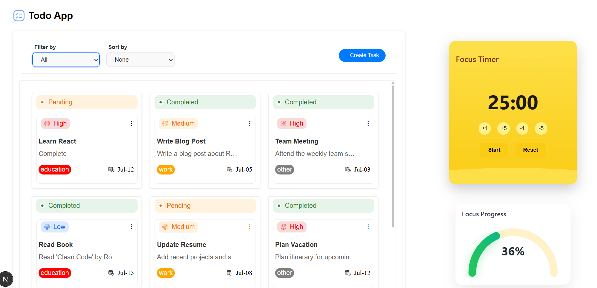
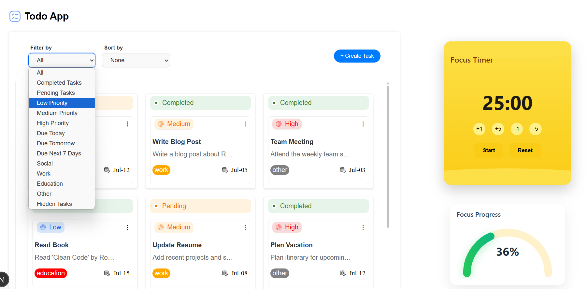
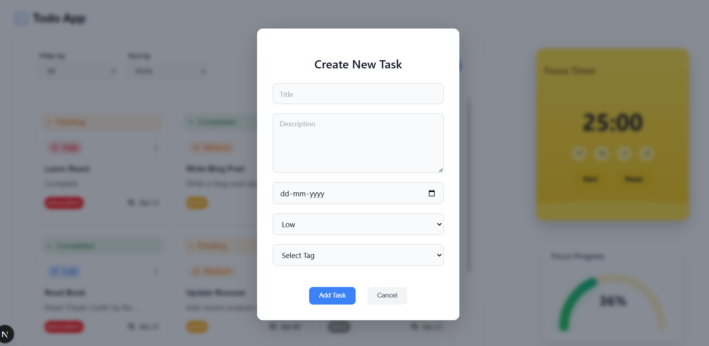
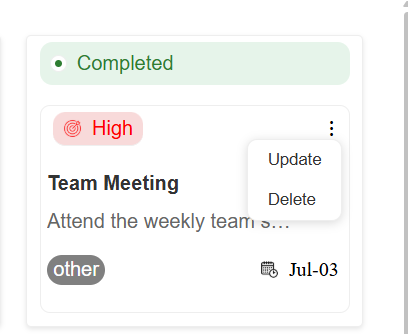
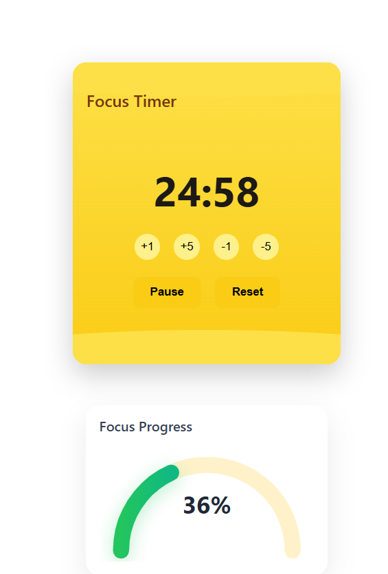

# Todo_Venu

A simple **Todo List Application** with a **full-stack setup**:  
**ASP.NET Core Web API** (backend) + **Next.js** (frontend).  
This project is a great foundation for learning CRUD operations, clean architecture, JWT authentication, and modern full-stack development.

---

## ✨ Features

✅ Add, edit, delete tasks  
✅ Mark tasks as completed or pending  
✅ Set priorities and due dates  
✅ Clean architecture with DTOs and AutoMapper  
✅ Fiter and Sort tasks as needed
✅ Authentication with JWT
✅ Responsive Next.js frontend  
✅ RESTful API integration

---

## 📂 Project Structure

```
Todo_Venu/
 ├── TodoAPI/               # ASP.NET Core backend
 │   ├── Controllers/
 │   ├── Models/
 │   ├── Data/
 │   ├── DTOs/
 │   ├── Services/
 │   ├── Program.cs
 │   ├── appsettings.json
 │   └── ...
 ├── todo-ui/ # Next.js frontend (App Router)
 │  ├── app/
 │  │  ├── (auth)/ # Auth routes
 │  │  │ ├── login/page.jsx
 │  │  │ ├── signup/page.jsx
 │  │  ├── (main)/ # Main protected routes
 │  │  │ ├── dashboard/page.jsx
 │  │  ├── layout.js # Root layout
 │  │  ├── page.jsx # Home page
 │  ├── components/ # Reusable components
 │  ├── public/ # Static files
 │  ├── package.json
 │  └── ...
```

---

## ⚙️ Technologies Used

- **Backend**: ASP.NET Core Web API
- **ORM**: Entity Framework Core
- **Database**: SQL Server Express
- **Frontend**: Next.js 14, CSS Modules
- **Auth**: JWT
- **Tools**: Visual Studio Code, SSMS, Postman, Git

---

## 🚀 Getting Started

### 1️⃣ Clone the repository

```bash
git clone https://github.com/gh-venu-regula/todo_Venu.git
cd todo_Venu
```

---

### 2️⃣ Backend Setup

1. Update your connection string in `appsettings.json`
2. Run EF Core migrations:

   ```bash
   dotnet ef database update
   ```

3. Run the backend API:

   ```bash
   cd TodoAPI
   dotnet run
   ```

   The API will be available at `https://localhost:5001` or `http://localhost:5000`

---

### 3️⃣ Frontend Setup (Next.js)

1. Open a new terminal and navigate to the frontend:

   ```bash
   cd todo-ui
   ```

2. Install dependencies:

   ```bash
   npm install
   ```

3. Start the Next.js app:

   ```bash
   npm run dev
   ```

   The frontend will run at `http://localhost:3000` by default.

---

## 📬 API Endpoints (Sample)

| Method | Endpoint               | Description               |
|--------|------------------------|---------------------------|
| GET    | /api/todos             | Get all todos             |
| GET    | /api/todos/{id}        | Get single todo by ID     |
| POST   | /api/todos             | Create new todo           |
| PUT    | /api/todos/{id}        | Update todo               |
| DELETE | /api/todos/{id}        | Delete todo               |

---

## 🎨 Screenshots
Here are some screenshots showcasing the Next.js frontend:

## 🎨 Screenshots







---

## 🗒️ Future Enhancements

- ✅ JWT authentication for protected routes
- ✅ Role-based authorization (Admin/User)
- ✅ Better error handling and validation
- ✅ UI improvements and animations
- ✅ Unit and integration tests
- ✅ Deployment to Azure/AWS

---

## 🤝 Contributing

Pull requests are welcome! Open an issue for bugs or suggestions.

---

## 📄 License

This project is open-source under the [MIT License](LICENSE).

---

## 👤 Author

**Venu Regula**  
[GitHub](https://github.com/gh-venu-regula)

---

**Happy Coding! 🚀**

